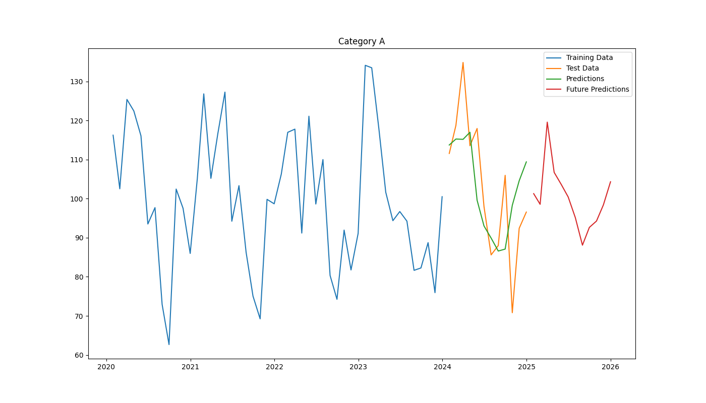
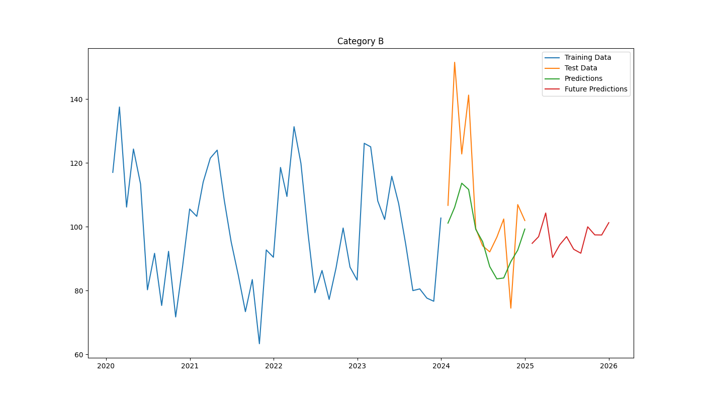
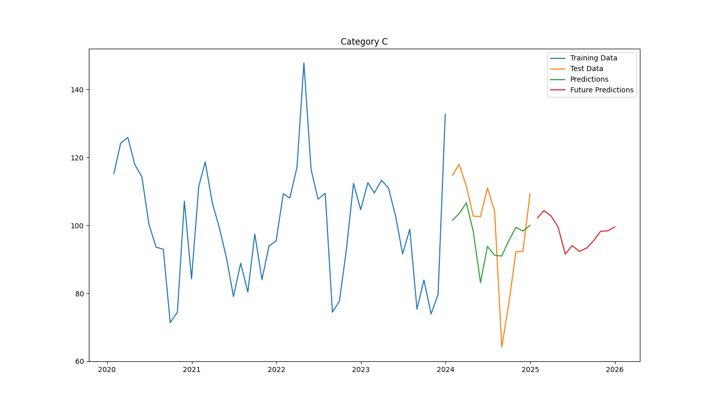

# Time Series Demand Forecasting

This repository contains code and resources for time series demand forecasting.

## Overview

The goal of this project is to forecast future demand using historical data. The main script used for forecasting is `forecast.py`.

## Requirements

To run the code, you need the following Python packages:
- pandas
- numpy
- matplotlib
- scikit-learn
- statsmodels

You can install the required packages using:
```bash
pip install -r requirements.txt
```

## Usage

To generate forecasts, run the `forecast.py` script:
```bash
python forecast.py
```

## Forecasted Graphs

Below are some of the forecasted graphs generated by the `forecast.py` script:




## License

This project is licensed under the MIT License. See the [LICENSE](LICENSE) file for details.

## Acknowledgements

Special thanks to all the contributors and the open-source community.
